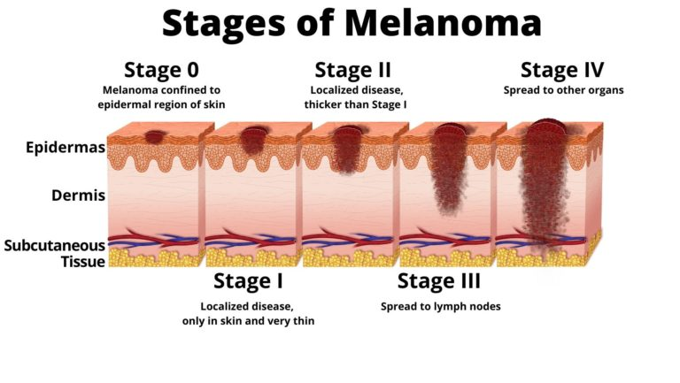

# MELANOMA DETECTION CASE STUDY

 

## TABLE OF CONTENTS
* [Overview](#overview)
* [Business Objectives](#business-objectives)
* [Technologies Used](#technologies-used)

## OVERVIEW

Melanoma is a type of cancer that can be deadly if not detected early. It accounts for 75% of skin cancer deaths. 

A solution that can evaluate images and alert dermatologists about the presence of melanoma has the potential to reduce a lot of manual effort needed in diagnosis.

Goal is to build a CNN based model which can accurately detect melanoma and save lives.

## BUSINESS OBJECTIVES

Goal is to build a multiclass classification model using a custom convolutional neural network in TensorFlow

## TECHNOLOGIES USED

Analytical Tools / Environments : Google Colab, Python Libraries 
                  
Visualisation   : Python

## AUTHOR
Sibi Rajan 
